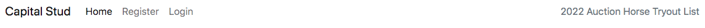
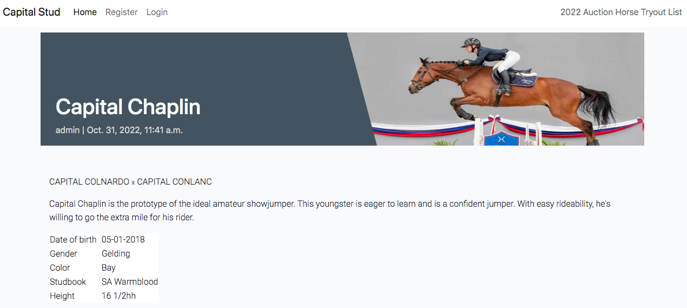
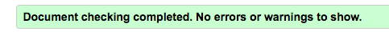

# Capital Stud Tryouts Auction List 2022

This is a blog/website to present the horses we have on auction to try out for 2022. On there, as a superuser/admin, I can make posts about each auction horse on the list and autheticated users can comment and like posts as well. It's overall quite simple in it's design but it works very well in it's design as intended and is interactive which is great for the prospective clients.

# Business

The Business goals describe the expected user and site owner goals - these drive the design, development, and deployment of the blog/website application. The fulfillment of these goals determine the success of the application.

## External Users

The external users are potential and actual customers of Capital Stud. They are looking for information on the various horses being offered on auction for 2022, as well as being able to contact us to book a tryout of any of the horses.

## Site Owner

The site owner is looking to attract potential customers and be able to manage customer tryout bookings and contact requests in order to engage to the users.

## Features 

### Existing Features

- __Navigation Bar__

  There's a nav bar at the top of the screen. You can go to the homepage, log in/out, sign up.

- __The Blog Posts__

  You can see all the different blog posts that have been made, I as admin add these posts manually through Django Admin. The posts have the image of each horse, and if you click on each one it takes you to the post with more information.From here, you can see the likes and comments on a post as well. 

- __Login Page__
  This is where users who have made an account can sign in and from there they can comment on posts, like posts and will have the option to contact me as well. 
 

- __Sign Up page__

  Before the user can login, they must register and sign up to the website. They will have to enter a username and secure password. 

- __Logout__

  If the user wants, they also have the option to sign out of their account too. You will be asked if you are sure you want to leave the site.

 __A Blog Post__

  So here is a blog post itself: The name of the horse and it's image are held within a masthead at the top and the information of the horse itself is below.

- __Blog Post Comments__ 

  Users can see their comments and other people's comments, as well as how long ago they were posted. They can also edit them and delete them from here as well. To make a comment a user must be signed in on their account. 

# User Stories

The following user stories have been created to ensure the goals of the users and owner are met.

| User Story | Goal |
| --- | --- |
| **User Story 001:** As a user i can view a post so that i may select one to read | identifying horses on auction |
| **User Story 002:** As a user i can open a post so that i may see all its details | Finding more information on each horse on the auction |
| **User Story 003:** As a site user i can view likes so that users and admin can see which posts are liked | likes on blog posts |
| **User Story 004:** As a site user i can register an account so that i can comment and like and be interactive with the site | Ability to register,sign in,log out |
| **User Story 005:** As a site user i can comment on photos so that i can add my opinion to which horses i like | Ability to comment on blog posts |
| **User Story 006:** As a site user i can like or unlike a post so that i can be interactive with the content | Ability to like/unlike blog posts |
| **User Story 007:** As a site admin i can create, read, update and delete posts so that i can manage content on the site | Ability for admin to manage posts |
| **User Story 008:** As a site admin i can approve or dismiss comments so that we only have comments benefical to the site | Ability for admin to approve/dismiss posts|

## Administrators

An administrator is a manager of the Capital Stud page. This requires the use of a superuser account username and password, as this is not public-facing information.

-  with:
    - the ability for the admin superuser to log in

-  with:
    - the ability to create, view, update and delete the auction horse information visible on the public site.

# Technology

## Key Technology Used

The following key technologies and languages have been used as part of this website:

- [HTML 5](https://en.wikipedia.org/wiki/HTML): HyperText Markup Language, the standard markup language for documents designed to be displayed in a web browser
- [CSS 3](https://en.wikipedia.org/wiki/CSS): style sheet language used for describing the presentation of a document
- [JavaScript](https://www.javascript.com/): high-level, often just-in-time compiled language
- [jQuery](https://jquery.com/): JavaScript library
- [Python](https://www.python.org/): high-level, general-purpose programming language
- [Django](https://www.djangoproject.com/): Python-based open-source web framework
- [Postgresql](https://www.postgresql.org/): open-source database to hold back-end data
- [GitHub](https://github.com/): code repository
- [GitPod](https://www.gitpod.io/): integrated development environment (IDE)
- [Heroku](https://www.heroku.com/): deployment of the website and application

### User Story Board

A user story board was used to assist with the organisation of building the website. This included the user stories representing the key features that should be implemented. These were sorted into the following lists:

- To Do: features where no progress had been started.
- In Progress: features where progress has commenced, but not completed.
- Done: features that have been fully implemented.

Each user story started in the To Do list, and was moved through to In Progress and Done as development continued. This assisted with ensuring the work was performed in an organised manner.

# Testing

## Manual Testing

Manual use cases have been run to test the functionality of the website.

The tables below show the user stories, the associated use cases, the task script followed for the test, and whether this passed or failed. These have been split by user-related and owner-related functionality.

### User Testing

| User Story -> Tasks | Pass/Fail |
| --- | --- |
| **User Story 001:** As a user i can view a post so that i may select one to read | PASS |
| + > **Task 1:** Open the home page -> the posts should be visible showing all the horses available | PASS |

| **User Story 002:** As a user i can open a post so that i may see all its details | PASS |
| + > **Task 1:** Open a post -> the post should be visible showing the information on the horse selected | PASS |

| **User Story 003:** As a site user i can view likes so that users and admin can see which posts are liked | PASS |
| + > **Task 1:** On the main page and selected posts -> the likes should be visible on each post | PASS |

| **User Story 004:** As a site user i can register an account so that i can comment and like and be interactive with the site | PASS |
| + > **Task 1:** Open the home page -> you should be able to sign in,login in and logout | PASS |

| **User Story 005:** As a site user i can comment on photos so that i can add my opinion to which horses i like | PASS |
| + > **Task 1:** Open a blog post -> you should be able to comment on the post | PASS |

| **User Story 006:** As a site user i can like or unlike a post so that i can be interactive with the content | PASS |
| + > **Task 1:** Open a blog post -> you should be able to like/unlike a blog post | PASS |

| **User Story 007:** As a site admin i can create, read, update and delete posts so that i can manage content on the site | PASS |
| + > **Task 1:** Open the django admin page -> admin should be able to manage all post activity | PASS |

| **User Story 008:** As a site admin i can approve or dismiss comments so that we only have comments benefical to the site | PASS |
| + > **Task 1:** Open the django admin page -> admin should be able to approve/dismiss comments made by the public | PASS |

### Bugs

No unfixed bugs have been currently identified in the code.

## Code Validation

### HTML 
[W3C HTML Validator](https://validator.w3.org/)

### CSS
[W3C CSS Validator](https://jigsaw.w3.org/css-validator/)

### JavaScript
[JSHint Validator](https://jshint.com/)

### Python
[PEP8 Validator](https://extendsclass.com/python-tester.html)

- admin.py
- forms.py
- models.py
- urls.py
- views.py

### Lighthouse Validator 

#### Mobile

#### Desktop

### Frameworks, Libraries, Programs
- Python Built-in Modules:
  - [os](https://docs.python.org/3/library/os.html) 

- External Packages
  - [cloudinary](https://pypi.org/project/cloudinary/1.29.0/) 
  - [crispy-bootstrap5](https://pypi.org/project/crispy-bootstrap5/0.6/) 
  - [dj-database-url](https://pypi.org/project/dj-database-url/0.5.0/) 
  - [dj3-cloudinary-storage](https://pypi.org/project/dj3-cloudinary-storage/0.0.6/) 
  - [Django](https://pypi.org/project/Django/3.2.14/) 
  - [django-allauth](https://pypi.org/project/django-allauth/0.51.0/)
  - [django-crispy-forms](https://pypi.org/project/django-crispy-forms/1.14.0/) 
  - [gunicorn](https://pypi.org/project/gunicorn/20.1.0/)
  - [psycopg2](https://pypi.org/project/psycopg2/2.9.3/) 

  ### Programs & Tools

- [Google Fonts:](https://fonts.google.com/)
  - Was used to to incorporate font styles.  
- [Bootstrap](https://getbootstrap.com/)
  - Was used to create the front-end design.
- [GitPod:](https://gitpod.io/)
  - Gitpod was used as IDE to commit and push the project to GitHub.
- [GitHub:](https://github.com/)
  - Was used for all storing and backup of the code pertaining to the project.

  ### Forking the GitHub Repository
1. Go to the project repository
2. In the right most top menu, click the "Fork" button.
3. There will now be a copy of the repository in your own GitHub account.

### Running the project locally
1. Go to the project repository
2. Click on the "Code" button.
3. Choose one of the three options (HTTPS, SSH or GitHub CLI) and then click copy.
4. Open the terminal in you IDE program. 
5. Type `git clone` and paste the URL that was copied in step 3.
6. Press Enter and the local clone will be created. 

### Alternatively by using Gitpod:
1. Go to the project repository
2. Click the green button that says "Gitpod" and the project will now open up in Gitpod.

### Deploying with Heroku

I followed the below steps using the Code Institute tutorial:

The following command in the Gitpod CLI will create the relevant files needed for Heroku to install your project dependencies `pip3 freeze --local > requirements.txt`. Please note this file should be added to a .gitignore file to prevent the file from being committed.

1. Go to [Heroku.com](https://dashboard.heroku.com/apps) and log in; if you do not already have an account then you will need to create one.
2. Click the `New` dropdown and select `Create New App`.
3. Enter a name for your new project, all Heroku apps need to have a unique name, you will be prompted if you need to change it.
4. Select the region you are working in.

#### Heroku Settings  
You will need to set your Environment Variables - this is a key step to ensuring your application is deployed properly.
1. In the Settings tab, click on `Reveal Config Vars` and set the following variables:
    - Add key: `PORT` & value `8000`
    - Add key: DATABASE_URL, this should have been created automatically by Heroku.
    - Add key: CLOUDINARY_URL and the value as your cloudinary API Environment variable e.g.
    - Add key: SECRET_KEY and the value as a complex string which will be used to provide cryptographic signing.

2. Buildpacks are also required for proper deployment, simply click `Add buildpack` and search for the ones that you require.
    - For this project, I needed to add `Python`.

####  Heroku Deployment  
In the Deploy tab:
1. Connect your Heroku account to your Github Repository following these steps:
    - Click on the `Deploy` tab and choose `Github-Connect to Github`.
    - Enter the GitHub repository name and click on `Search`.
    - Choose the correct repository for your application and click on `Connect`.
2. You can then choose to deploy the project manually or automatically, automatic deployment will generate a new application every time you push a change to Github, whereas manual deployment requires you to push the `Deploy Branch` button whenever you want a change made.
3. Once you have chosen your deployment method and have clicked `Deploy Branch` your application will be built and you should now see the `View` button, click this to open your application.

### Credits

Huge thanks go to Matt Rudge for the CodeStar blog videos. Would also like to thank the Slack Community for their help on this project as well.

